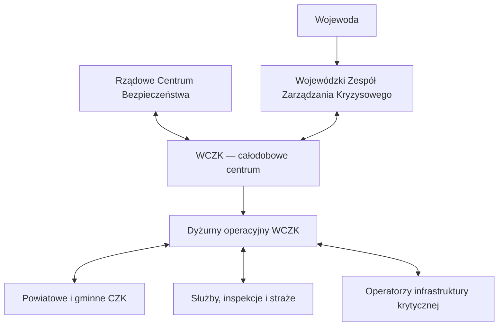

# VECTOR OPS — Primary Operator in the Polish Crisis-Management System

**Version:** 0.1  
**Date:** 22 September 2026  
**Milestone:** M1 — Discovery Complete  
**Issue:** #3 — Define primary operator persona  
**Status:** Research completed; primary operator selected

---

## 1. Executive conclusion

The closest real Polish counterpart to the working concept of a “Regional Infrastructure Coordination Officer” is:

> **Dyżurny operacyjny Wojewódzkiego Centrum Zarządzania Kryzysowego (WCZK)**  
> English portfolio label: **Duty Operations Officer — Voivodeship Crisis Management Centre**

This is a real role visible in current Polish civil-service recruitment. Depending on the office, the formal position may be described as:

- *dyżurny operacyjny / dyżurna operacyjna*,
- *starszy specjalista do spraw pełnienia całodobowego dyżuru w WCZK*,
- a similar civil-service title assigned to the WCZK duty function.

The role is a strong fit for VECTOR OPS because it operates continuously across organisational and sector boundaries. It monitors threats, assesses and forecasts developments, evaluates reports, maintains information flow, activates procedures, supports warning and alerting, and documents the response.

The key correction to the original working concept is its authority boundary:

> The WCZK duty officer is not an independent commander of electricity, telecommunications, water or transport operators.

Formal direction of crisis-management activity at voivodeship level belongs to the **voivode**. The **Voivodeship Crisis Management Team (WZZK)** evaluates threats and develops proposals for the voivode. The duty officer provides the continuous operational layer: building and maintaining the current picture, recognising consequences, routing information, initiating authorised procedures and escalating decisions.

VECTOR OPS should therefore support **assessment, coordination, procedure activation, recommendation, escalation and documentation**, not portray the user as directly commanding every external organisation.

---

## 2. Institutional placement

This diagram is a simplified product-research model, not a complete legal command structure.

### Voivode

Under the Act on Crisis Management, the voivode is the competent crisis-management authority in the voivodeship. The voivode directs monitoring, planning, response and recovery and organises tasks concerning critical-infrastructure protection.

### Voivodeship Crisis Management Team

The WZZK is the voivode's supporting body. It assesses actual and potential threats, forecasts their development and prepares proposals for actions to be taken, changed or discontinued under the voivodeship crisis-management plan.

### Wojewódzkie Centrum Zarządzania Kryzysowego

The WCZK is the permanent operational centre supported by the crisis-management unit of the voivodeship office. Its statutory tasks include:

- maintaining a 24-hour duty to support crisis-management information flow,
- cooperating with other public-administration crisis-management centres,
- supervising detection, alerting and public-warning systems,
- cooperating with environmental-monitoring entities,
- cooperating with rescue, search and humanitarian operations,
- documenting actions undertaken by the centre,
- performing permanent-duty tasks connected with state defence readiness.

The voivodeship-office crisis-management unit also gathers and processes threat information, analyses and forecasts threat development, supplies information to crisis-management teams, processes information about critical infrastructure and plans support for other authorities.

### Operators of critical infrastructure

Critical-infrastructure operators retain responsibility for their own systems, continuity arrangements and restoration actions. Current law requires cooperation and information-exchange arrangements with crisis-management authorities and other relevant bodies.

The duty officer therefore coordinates **information and procedures across organisational boundaries**, while operational control of infrastructure remains distributed.

---

## 3. Why this role is the best primary persona

| Candidate | Strength | Limitation | Decision |
|---|---|---|---|
| WCZK duty operations officer | Continuous cross-domain monitoring, real information-routing and procedure role, direct fit with live operational interface | Limited authority over external operators | **Primary persona** |
| Member or secretariat of WZZK | Closer to recommendations presented to the voivode | Team convened according to need; less suitable as continuous hands-on system user | Secondary stakeholder |
| Voivode | Holds formal regional authority | Too senior and not the routine operator of the interface | Decision recipient |
| RCB duty officer | National cross-government perspective | Scope too broad for the first regional scenario | Future persona |
| PCZK duty officer | Strong local operational grounding | Narrower geographic and cross-sector scope | Future persona / scenario participant |
| Critical-infrastructure protection coordinator | Deep knowledge and responsibility within one operator | Represents one organisation rather than the shared regional picture | Data provider / collaborating persona |

The WCZK duty officer gives the demonstrator a credible position between raw reports and high-level authority.

---

## 4. Evidence-backed work description

### Continuous monitoring and early assessment

Current civil-service advertisements describe the role as providing 24-hour threat monitoring, conducting initial analysis, forecasting how a crisis may develop and ensuring rapid information flow.

This means the operator's work is not limited to message forwarding. The role requires interpreting reports and determining what may become significant.

### Evaluation of reports and meldunki

The duty officer assesses reports and operational messages from services and prepares information about threats. Other official descriptions refer to collecting current data, preparing situation reports and daily reports for RCB, and documenting the course of duty.

### Cross-organisational information exchange

Documented partners include:

- RCB,
- crisis-management centres of ministries and neighbouring voivodeships,
- powiat and municipal crisis-management centres,
- public-administration operational centres,
- command posts of services, inspections and guards,
- environmental-monitoring organisations,
- rescue, search and humanitarian actors,
- critical-infrastructure operators where relevant.

This network is structurally distributed. The duty officer's value lies partly in maintaining a coherent operational picture across messages received from organisations with different responsibilities and reporting practices.

### Analysis and forecasting

A 2026 recruitment notice for the Podlaskie Voivodeship Office explicitly includes analysing and forecasting crisis development. The Act also assigns threat monitoring, analysis and forecasting to the relevant voivodeship-office unit.

The role therefore has a legitimate need for:

- current state,
- trend and projected development,
- time-to-impact,
- evidence and source,
- data age,
- confidence and gaps,
- affected areas and services,
- escalation threshold.

### Procedure activation

Recruitment materials describe launching procedures contained in public-administration crisis-management plans. A detailed Dolnośląskie description includes procedures for monitoring, alerting, warning and informing the population, as well as handling alarm levels and permanent-duty signals.

VECTOR OPS may therefore let the user:

- identify the relevant procedure,
- verify triggering conditions,
- initiate or record authorised procedural steps,
- notify required organisations,
- escalate decisions requiring higher authority.

The demonstrator should not invent legal authority to issue arbitrary operational commands.

### Warning and communications systems

Public descriptions include work with:

- Regionalny System Ostrzegania,
- warning and alarm systems,
- videoconferencing,
- digital radio communications,
- classified and unclassified ICT systems,
- telephone and electronic correspondence.

These examples show that the real working environment involves several channels and systems. They do not establish that every WCZK uses the same toolset.

### Documentation and handover

Documentation is a statutory WCZK task. Job descriptions include reports, analyses, situation reports and records of the duty.

For VECTOR OPS this supports:

- a time-stamped event log,
- source attribution,
- operator acknowledgement,
- recorded rationale,
- escalation history,
- procedure status,
- shift-handover summary.

---

## 5. Working environment

### Shift model

The role is performed as a continuous service. A 2026 Podlaskie recruitment notice describes work generally organised in 12-hour periods. Other offices refer to shift work and non-standard working hours.

The exact shift pattern varies by institution and must not be presented as universal.

### Physical and cognitive environment

Official recruitment descriptions include:

- work at a computer for more than half of working time,
- office and document work,
- telephone contact with internal and external organisations,
- multi-person or enclosed workspaces,
- non-standard hours,
- stress resistance,
- occasional activity outside the immediate workstation,
- use of classified and unclassified information systems.

The product context is therefore a desktop-first operational workplace rather than a mobile-first field application.

### Skills and knowledge

Recruitment notices commonly require or value:

- knowledge of crisis-management and civil-protection law,
- ability to analyse reports and argue a position,
- clear communication,
- teamwork,
- work organisation,
- stress resistance,
- experience in public administration or public security,
- security clearance or willingness to undergo vetting for relevant posts.

The persona should be treated as a trained professional, not as a novice requiring consumer-style simplification.

---

## 6. Primary operator definition

### Role

**Dyżurny operacyjny WCZK** responsible for maintaining the current regional operational picture during a developing, multi-sector disruption.

### Goal

Recognise which reported changes may develop into significant consequences, ensure the right information reaches the right organisations in time, initiate applicable procedures and provide decision-makers with an evidence-backed recommendation.

### Core responsibilities

- monitor threats and service disruptions,
- evaluate reports and identify information gaps,
- connect developments across sectors and territories,
- forecast likely consequences and time pressure,
- maintain contact with lower-level centres, services and operators,
- initiate authorised procedures,
- prepare warnings, situation information and escalation packages,
- document actions and support shift handover.

### Information needs

- what happened, where and when,
- reporting source and timestamp,
- current operational status,
- affected population, territory and essential services,
- infrastructure dependencies,
- expected development and time-to-impact,
- uncertainty and missing confirmation,
- active procedures and escalation thresholds,
- available public-response resources,
- responsible organisation and contact status,
- actions already taken and their observed results.

### Time pressure

Routine monitoring can rapidly become time-critical when:

- backup power has limited endurance,
- a service disruption crosses powiat boundaries,
- weather or access conditions delay restoration,
- multiple reports describe parts of the same cascade,
- warning or escalation thresholds are approaching,
- the next shift needs a reliable handover.

### Common failure modes

The following are **research-informed hypotheses**, not verified universal failures:

- related messages remain separate and their common consequence is recognised late,
- a high-volume incident obscures a lower-volume but more critical dependency,
- stale or unconfirmed information is treated as current,
- different organisations use incompatible status language,
- the operator cannot quickly see which procedure or escalation threshold applies,
- a recommendation is passed upward without an inspectable rationale,
- actions, assumptions and ownership become difficult to reconstruct during handover,
- the interface overstates certainty or implies authority the duty officer does not possess.

These should be evaluated with practitioners.

---

## 7. Authority and decision boundary

### The primary operator may credibly

- acknowledge and classify incoming information,
- connect reports to incidents, assets and dependencies,
- request confirmation or missing information,
- assess and forecast possible development,
- identify a relevant plan or procedure,
- initiate authorised procedural steps,
- prepare and send a situation report,
- escalate to the WCZK leadership, WZZK or voivode,
- recommend a priority or coordination action,
- record the decision, authority, rationale and outcome.

### The primary operator should not be portrayed as independently able to

- switch or reconfigure an electricity network,
- command a telecommunications or water operator,
- dispatch any external organisation's resources without authority,
- issue binding cross-sector restoration priorities solely through the interface,
- disclose real locations or vulnerabilities of critical infrastructure,
- replace the voivode, WZZK or sector operator's decision-making authority.

This boundary materially changes the design language. Use **recommend**, **escalate**, **request**, **activate procedure**, **notify** and **record approval** rather than a generic **execute** button for external actions.

---

## 8. Jobs to be done

### Primary job

> When reports from several organisations describe a developing disruption, help me recognise the combined regional consequence, verify the evidence and prepare the correct coordination or escalation action before the situation crosses a critical threshold.

### Supporting jobs

- Help me distinguish a new incident from another report about an existing incident.
- Help me see which essential services depend on the affected asset or service.
- Help me understand how much time remains before a downstream consequence.
- Help me identify stale, conflicting or missing information.
- Help me prepare a concise situation report without losing the evidence trail.
- Help me identify the applicable procedure and required recipients.
- Help the next shift understand what changed, what was decided and what still requires confirmation.

---

## 9. Implications for the public-alpha scenario

The alpha should place the user on duty in a **fictional WCZK inspired by the Polish system**. It should not use real critical-infrastructure locations, operator data or confidential procedures.

A credible scenario structure is:

1. The duty officer receives separate reports concerning power, telecommunications, water and blocked access.
2. VECTOR OPS links them into a projected regional consequence.
3. The officer inspects sources, timestamps, dependencies, uncertainty and time-to-impact.
4. The officer requests one missing confirmation or marks an assumption.
5. The officer chooses among coordination options:
   - monitor and request more information,
   - activate a predefined notification/procedure,
   - prepare an escalation package with a recommended priority.
6. A higher authority or responsible organisation approves or rejects actions outside the duty officer's mandate.
7. The system records the rationale, recipients and observed downstream effects.

The “wow moment” should be the transition from several credible but disconnected reports to one inspectable consequence and a properly bounded coordination action.

---

## 10. Product and market interpretation

### Direct user

Duty operations officer or senior specialist performing the WCZK duty function.

### Institutional environment

Voivodeship office, specifically the unit responsible for security and crisis management.

### Important collaborators

- WCZK management and other duty staff,
- WZZK and the voivode,
- RCB,
- powiat and municipal centres,
- services, inspections and guards,
- operators and coordinators of critical infrastructure,
- environmental and meteorological monitoring bodies.

### Adjacent future users

- duty staff in powiat crisis-management centres,
- national-level RCB duty staff,
- critical-infrastructure protection coordinators,
- analysts preparing situation reports,
- exercise and training participants.

### Commercial caution

The evidence establishes a real user role and operating context, not procurement demand or willingness to adopt VECTOR OPS. Public-sector procurement, classified information, legal compliance and integration requirements would be substantial for a real deployment.

For the portfolio, the appropriate claim is:

> VECTOR OPS is a synthetic demonstrator exploring decision support for a real Polish crisis-management role.

---

## 11. Remaining validation gaps

Before presenting the persona as validated, seek practitioner input on:

- actual shift routines and handover,
- typical volume and format of incoming reports,
- which systems are used in a selected voivodeship,
- how infrastructure-operator information reaches WCZK,
- which decisions the duty officer may initiate without additional approval,
- how situation reports and recommendations are structured,
- common causes of delay or duplication,
- use of maps, dependency data and forecasts,
- handling of uncertainty and conflicting reports,
- security classification and information-sharing limits.

A 30–45 minute interview with a current or former WCZK/PCZK practitioner would be the highest-value next validation activity.

---

## 12. Primary sources

1. **Act of 26 April 2007 on Crisis Management — current consolidated text viewed 22 September 2026.** Articles 14 and 16 define the voivode, voivodeship crisis-management unit, WZZK and WCZK tasks.  
   https://isap.sejm.gov.pl/isap.nsf/DocDetails.xsp?id=WDU20070890590
2. **Podlaskie Voivodeship Office — recruitment for Duty Operations Officer, February 2026.** Current role title, analysis, forecasting, report evaluation, procedure activation, requirements and 12-hour working pattern.  
   https://nabory.kprm.gov.pl/podlaskie/bialystok/inspektor-wojewodzkiinspektorka-wojewodzka,161226,v7
3. **Podlaskie Voivodeship Office — recruitment for Senior Specialist performing 24-hour WCZK duty, August 2025.** Monitoring, initial analysis, forecasting, information flow and reporting.  
   https://nabory.kprm.gov.pl/podlaskie/bialystok/starszy-specjalista,155683,v7
4. **Dolnośląskie Voivodeship Office — recruitment for Senior Specialist performing 24-hour WCZK duty, December 2023.** Cooperation network, procedures, monitoring and operational systems.  
   https://nabory.kprm.gov.pl/dolnoslaskie/wroclaw/starszy-specjalista,131073,v7
5. **RCB — Information flow and the role of RCB in the crisis-management system.**  
   https://www.gov.pl/web/rcb/obieg-informacji-i-rola-rcb-w-systemie-zarzadzania-kryzysowego
6. **Zachodniopomorskie Voivodeship Office — Crisis Management Branch tasks.**  
   https://www.gov.pl/web/uw-zachodniopomorski/oddzial-bezpieczenstwa-publicznego-i-zarzadzania-kryzysowego
7. **Łódzkie Voivodeship Office — Crisis Management Branch tasks.**  
   https://www.gov.pl/web/uw-lodzki/oddzial-zarzadzania-kryzysowego
8. **RCB — Critical infrastructure systems.**  
   https://www.gov.pl/web/rcb/systemy-infrastruktury-krytycznej

---

## 13. Final recommendation

Select **Dyżurny operacyjny Wojewódzkiego Centrum Zarządzania Kryzysowego** as the primary operator for the public alpha.

Use the English presentation label **Duty Operations Officer — Voivodeship Crisis Management Centre**, retaining the Polish title in the case study to demonstrate real institutional grounding.

Design the first scenario around consequence recognition, information verification, procedure activation, recommendation and escalation. Do not grant the persona fictional command authority over independent infrastructure operators.
